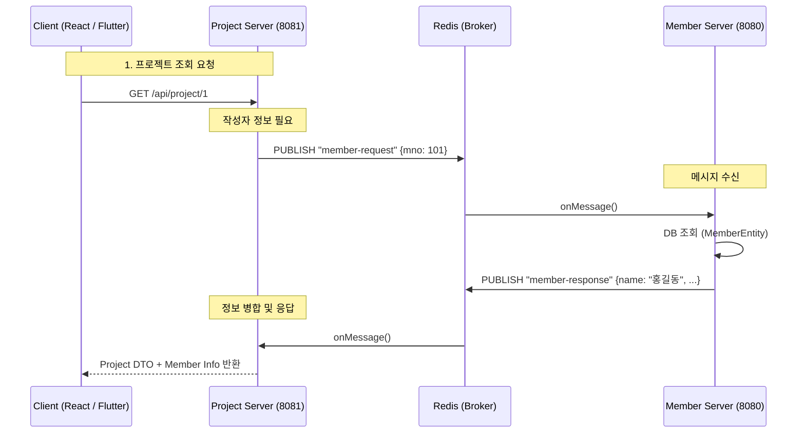

-----

# 👀 LC-Eye – 경량형 LCI(Life Cycle Inventory) 계산 시스템

> **Redis Pub/Sub 기반의 다중 서버 아키텍처와 React 프론트엔드를 도입한 환경영향평가 플랫폼** <br>
> 🔗 [프로젝트 노션 바로가기](https://lceye.notion.site/LC-Eye-2a2094d4983480369aa4fe1a6163688f) <br>
> 🔗 단일 서버용 GitHub [GitHub 바로가기](https://github.com/JeonghoonAHN0510/LC-Eye) <br>
> 🔗 다중 서버용 GitHub [Back_Member](https://github.com/JeonghoonAHN0510/LC-Eye_Member) &nbsp;|&nbsp; [Back_Project](https://github.com/JeonghoonAHN0510/LC-Eye_Project) &nbsp;|&nbsp; [React](https://github.com/JeonghoonAHN0510/LC-Eye_React) &nbsp;|&nbsp; [Flutter](https://github.com/msh-94/lc_eye_project) <br>

-----

## 🧭 프로젝트 개요

**LC-Eye**는 제품·공정 단위의 투입물·산출물 데이터를 기반으로 환경부하를 정량화하는 툴입니다.
서비스의 확장성과 유지보수성을 높이기 위해 \*\*Member Server(회원/인증)\*\*와 \*\*Project Server(계산/관리)\*\*로 백엔드를 분리하였으며, **Redis Pub/Sub**를 통해 서버 간 데이터 정합성을 유지합니다.

프론트엔드는 **React**로 구축하여 SPA(Single Page Application) 기반의 끊김 없는 사용자 경험을 제공하며, 대용량 데이터 처리와 실시간 상호작용에 최적화된 아키텍처를 갖추고 있습니다.

  - **개발기간:** 2025.11.05 \~ 2025.11.27 (3주)
  - **팀명:** LC-Eye
  - **인원:** 3명
    - 옹태경 - **팀장** / LCI 계산 로직 / S3 파일 처리 / Front 총괄 / 발표
    - 민성호 - **JSON 추천 로직** / 투입물·산출물·process 로직 / Flutter 총괄
    - 안정훈 - **MSA 기반 서버 분리** / 서버 간 통신 / Redisson 분산 락 / 버전 관리 / Front 공통 레이아웃

-----

## 🚀 핵심 목표

| 구분 | 설명 |
|------|------|
| ☁️ **하이브리드 스토리지** | 메타데이터(MySQL)와 대용량 Flow 데이터(AWS S3)를 분리 저장하여 성능 최적화 |
| 🏗️ **다중 서버 구축** | `Member`(8080)와 `Project`(8081) 서버 분리를 통해 도메인별 독립성 및 확장성 확보 |
| 📡 **비동기 통신 동기화** | Redis Pub/Sub를 활용하여 분리된 서버 간 데이터를 실시간으로 연동 (CompletableFuture 활용) |
| 🔒 **분산 환경 데이터 정합성** | Redisson 분산 락을 도입하여 다중 서버 환경에서의 동시성 문제(Race Condition) 해결 |

-----

## ⚙️ 개발환경

| 분류 | 기술 스택 |
|------|-------------|
| **Frontend** | **React**, **Flutter**, JavaScript, CSS |
| **Backend (Member)** | Java 17, Spring Boot, Spring Security (Auth/JWT) |
| **Backend (Project)** | Java 17, Spring Boot, **Redisson** (Distributed Lock) |
| **Middleware** | **Redis** (Pub/Sub, Session, Cache) |
| **Database** | MySQL (RDB), AWS S3 (JSON Storage) |
| **Collaboration** | GitHub, Notion |

-----

## 🧱 아키텍처 개요

### 🗂 Multi-Server Architecture

시스템은 기능적 응집도를 높이기 위해 두 개의 독립된 Spring Boot 애플리케이션으로 구성됩니다.

1.  **Client (React / Flutter Server):** 사용자 인터페이스 담당, API Gateway 역할 없이 각 서버 API 호출 (CORS 설정)
2.  **Member Server (Port 8080):** 회원가입, 로그인(JWT 발급), 회사 정보 관리, 권한 인증 담당
3.  **Project Server (Port 8081):** 프로젝트 생성, LCI 계산, 투입/산출물 관리, 엑셀 리포팅 담당
4.  **Redis (Message Broker):** 두 서버 간의 데이터 교환 및 분산 락 관리

### 🔄 Inter-Service Communication (Redis Pub/Sub)

HTTP 통신 대신 **Redis Pub/Sub**를 사용하여 마이크로서비스 간 결합도를 낮췄습니다.

  * **요청 흐름:** Project 서버에서 회원 정보 필요 시 → `member-request` 채널 발행
  * **응답 흐름:** Member 서버에서 구독 중 메시지 수신 → DB 조회 후 `member-response` 채널로 응답
  * **동기화 처리:** `CompletableFuture`를 사용하여 비동기 응답을 동기 요청처럼 처리, API 응답 속도 보장

-----

## 🧩 주요 기능

### 🖥️ Frontend (React)

  * **관리자/사용자 대시보드:** `src/admin` 및 `src/user` 디렉토리 구조화를 통한 역할별 UI 분리
  * **실시간 데이터 연동:** Axios 인터셉터를 활용한 JWT 토큰 자동 관리 및 API 요청 최적화
  * **동적 UI 컴포넌트:** 드래그 앤 드롭, 리사이징 가능한 레이어 (`dragResizeLayer.css`) 및 반응형 테이블 구현

### 🖥️ Frontend (Flutter)

  * **간단 프로젝트 조회:** 프로젝트 전체·개별 조회 가능

### 👤 Member Server (8080)

  * **통합 인증 시스템:** JWT 기반의 로그인 인증 및 권한 부여
  * **MSA 데이터 제공:** Project 서버의 요청에 대해 회원/회사 정보를 조회하여 반환하는 내부 API 처리

### 🏭 Project Server (8081)

  * **LCI 계산 엔진:** 프로젝트별 투입/산출물(JSON)을 파싱하여 환경영향평가 결과 자동 산출
  * **자동 매칭 서비스:** 사용자가 입력한 자재명을 영문 번역(DeepL) 후 DB와 유사도 매칭(Jaro-Winkler)
  * **분산 락 적용:** 프로젝트 수정 및 계산 로직에 `@DistributedLock`을 적용하여 데이터 덮어쓰기 방지

-----

## 🗃️ 데이터 모델링 및 통신 구조

### 📡 Redis Pub/Sub 통신 시퀀스



-----

## 🔍 코드 구조 (Multi-Module)

```bash
Root/
├── LC-Eye_Member/          # [Server 1] 회원 및 인증 전담 (8080)
│   ├── src/main/java/lceye/
│   │   ├── controller/MemberController.java
│   │   ├── service/MemberService.java
│   │   └── config/SecurityConfig.java
│   └── ...
│
├── LC-Eye_Project/         # [Server 2] 프로젝트 및 계산 전담 (8081)
│   ├── src/main/java/lceye/
│   │   ├── controller/ProjectController.java
│   │   ├── service/LCICalculateService.java
│   │   └── util/aop/DistributedLockAspect.java
│   └── ...
│
└── src/                    # [Frontend] React Application
    ├── admin/              # 관리자 페이지 컴포넌트
    ├── assets/             # CSS, 이미지 리소스
    ├── App.jsx             # 라우팅 및 메인 진입점
    └── main.jsx            # React DOM 렌더링
```

-----

## 🧰 트러블슈팅 요약

| 문제 상황 | 원인 | 해결 방법 |
|:---:|:---:|:---|
| **태경님** | 트러블 슈팅 내용 | 해결 내용 |
| **성호님** | 트러블 슈팅 내용 | 해결 내용 |
| **정훈** | 트러블 슈팅 내용 | 해결 내용 |

-----

## 🧭 향후 개발 계획

| 구분 | 내용 |
|------|------|
| 🕸️ **개발 계획 생각하기** | 개발 계획1 |
| 🐳 **개발 계획 생각하기** | 개발 계획2 |

-----

## 🏁 프로젝트 후기

> "모놀리식 구조를 **Multi-Server 아키텍처로 분리**하여, 서비스 간의 결합도는 낮추고 사용자 경험은 높이는 성과를 거두었습니다. 특히 Redis를 단순 캐시가 아닌 **Message Broker**로 활용하여 MSA 통신 패턴을 직접 구현해본 값진 경험이었습니다."
>
> **- LC-Eye 개발팀**
