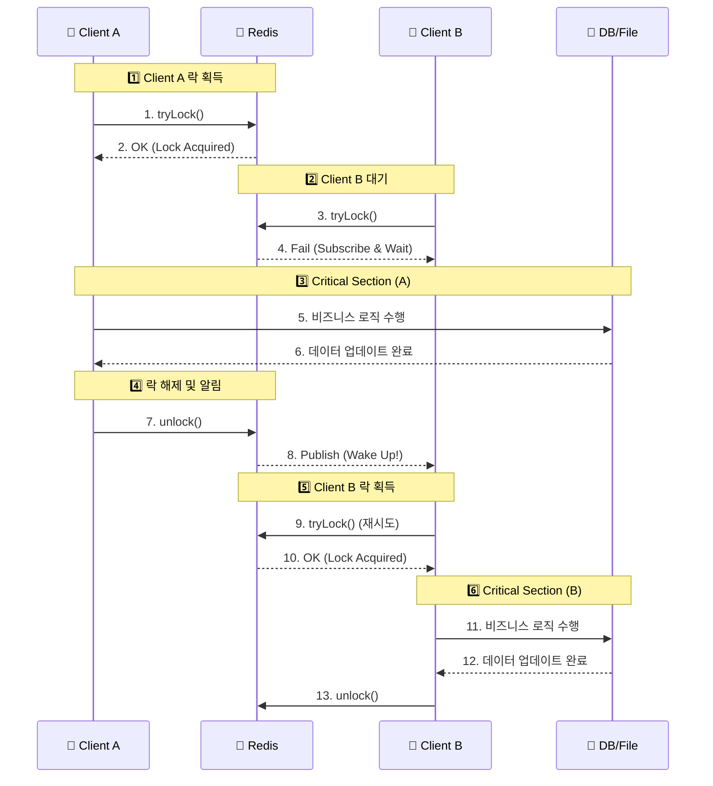
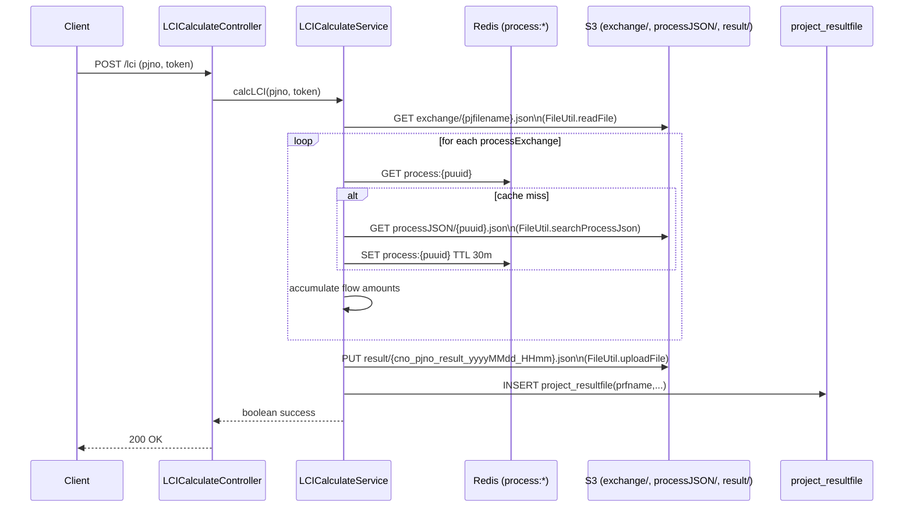

-----

# 👀 LC-Eye – 경량형 LCI(Life Cycle Inventory) 계산 시스템

> **Redis Pub/Sub 기반의 다중 서버 아키텍처와 React·Flutter를 도입한 전과정목록분석 플랫폼** <br>
> 🔗 프로젝트Notion [바로가기](https://lceye.notion.site/LC-Eye-2a2094d4983480369aa4fe1a6163688f) <br>
> 🔗 단일 서버용 GitHub [GitHub 바로가기](https://github.com/JeonghoonAHN0510/LC-Eye) <br>
> 🔗 다중 서버용 GitHub [Back_Member](https://github.com/JeonghoonAHN0510/LC-Eye_Member) &nbsp;|&nbsp; [Back_Project](https://github.com/JeonghoonAHN0510/LC-Eye_Project) &nbsp;|&nbsp; [React](https://github.com/JeonghoonAHN0510/LC-Eye_React) &nbsp;|&nbsp; [Flutter](https://github.com/msh-94/lc_eye_project) <br>
> 📃 발표자료 [PDF 바로가기](https://drive.google.com/file/d/139mwUQxmyiBQZLN5WCTaBkCL4sBBORIk/view?usp=sharing) <br>
> 💻 시연영상 [영상 바로보기](https://drive.google.com/file/d/1objnc56YuQeHpYGFZkyLe-8hU9B_7Fpt/view)

----

> ※ 참고사항 <br>
> 본 Repository는 단일 서버에서 모든 기능을 제공하고 있습니다. <br>
> 다중 분리 서버와 관련된 내용은 상단에 **\[다중 서버용 GitHub]** 를 참고하여 주시기 바랍니다.
 
-----

## 🧭 프로젝트 개요

**LC-Eye**는 제품·공정 단위의 투입물·산출물 데이터를 기반으로 환경부하를 정량화하는 툴입니다.

AWS S3와 Redis Caching를 결합하여 LCI 계산 과정에서 대용량 정적 데이터 처리의 안전성과 확장성을 동시에 확보하였습니다.
사용자의 기존 입출력 연결 이력을 기반으로 키워드-프로세스 맞춤 기능과 Gemini LLM 활용 키워드 매칭 서비스를 제공합니다.
서비스의 확장성과 유지보수성을 높이기 위해 \*\*Member Server(회원/인증)\*\*와 \*\*Project Server(계산/관리)\*\*로 백엔드를 분리하였으며, **Redis Pub/Sub**를 통해 서버 간 데이터 정합성을 유지합니다.

  - **개발기간:** 2025.11.05 ~ 2025.11.27 (3주)
  - **팀명:** LC-Eye
  - **인원:** 3명
    - 옹태경 - **팀장** / LCI 계산 로직 / AWS S3 파일 처리 / Front 총괄 / 발표
    - 민성호 - **Process JSON 추천 로직** / 투입물·산출물·process 키워드 기반 process 추천 로직 / Gemini LLM 활용 process 추천 / Flutter 총괄
    - 안정훈 - **MSA 기반 서버 분리** / 서버 간 통신 / Redisson 분산 락 / 버전 관리 / Front 공통 레이아웃

-----

## 🚀 핵심 목표

| 구분 | 설명 |
|------|------|
| ♻ **LCI 계산 알고리즘 구현** | 사용자 입력 데이터를 기반으로 단위공정별 투입물·산출물 총량을 계산 <br> AWS S3 Cloud Service · Redis Caching 활용한 데이터 처리 최적화 |
| 🔁 **자동 매칭 알고리즘 구현** | 사용자의 공정 또는 재료명 입력 데이터와 DB내 표준 flow 데이터와의 AI 자동 매칭 서비스 구축 |
| ☁️ **하이브리드 스토리지** | 메타데이터(MySQL)와 대용량 Flow·Process 데이터(AWS S3)를 분리 저장하여 성능 최적화 |
| 🏗️ **다중 서버 구축** | `Member`(8080)와 `Project`(8081) 서버 분리를 통해 도메인별 독립성 및 확장성 확보 <br> 📡 **비동기 통신 동기화** <br> Redis Pub/Sub를 활용하여 분리된 서버 간 데이터를 실시간으로 연동 (CompletableFuture 활용) <br> 🔒 **분산 환경 데이터 정합성**<br> Redisson 분산 락을 도입하여 다중 서버 환경에서의 동시성 문제(Race Condition) 해결 |

-----

## ⚙️ 개발환경

| 분류 | 기술 스택 |
|------|-------------|
| **Frontend** | **React**, **Flutter**, JavaScript, CSS |
| **Backend (Member)** | Java 17, Spring Boot, Spring Security (Auth/JWT) |
| **Backend (Project)** | Java 17, Spring Boot, **Redisson** (Distributed Lock) |
| **Middleware** | **Redis** (Pub/Sub, Session, Cache) |
| **Database** | MySQL (RDB), AWS S3 (JSON Storage) |
| **Collaboration** | GitHub, Notion |
| **etc** | apoche POI, Gemini, Socket |

-----

## 🧱 아키텍처 개요

### 🗂 1. Multi-Server Architecture

시스템은 기능적 응집도를 높이기 위해 두 개의 독립된 Spring Boot 애플리케이션으로 구성됩니다.

1)  **Client (React / Flutter Server):** 사용자 인터페이스 담당, API Gateway 역할 없이 각 서버 API 호출 (CORS 설정)
2)  **Member Server (Port 8080):** 회원가입, 로그인(JWT 발급), 회사 정보 관리, 권한 인증 담당
3)  **Project Server (Port 8081):** 프로젝트 생성, LCI 계산, 투입/산출물 관리, 엑셀 리포팅 담당
4)  **Redis (Message Broker):** 두 서버 간의 데이터 교환 및 분산 락 관리

### 2) 🔄 Inter-Service Communication (Redis Pub/Sub)

HTTP 통신 대신 **Redis Pub/Sub**를 사용하여 마이크로서비스 간 결합도를 낮췄습니다.

  * **요청 흐름:** Project 서버에서 회원 정보 필요 시 → `member-request` 채널 발행
  * **응답 흐름:** Member 서버에서 구독 중 메시지 수신 → DB 조회 후 `member-response` 채널로 응답
  * **동기화 처리:** `CompletableFuture`를 사용하여 비동기 응답을 동기 요청처럼 처리, API 응답 속도 보장

### 3) AWS S3 Cloud Service + Redis Caching

AWS S3와 Redis를 결합한 구조는 대용량 정적 데이터 처리의 안정성과 확장성을 동시에 확보할 수 있는 운영 기반을 마련하였습니다.

1) **AWS S3** : 대규모 JSON 파일을 효율적으로 관리하므로 서버의 저장 및 관리 부담을 최소화
2) **Redis Caching** : 반복적인 S3 접근에 대한 불필요한 통신을 최소화하여 데이터 조회속도와 시스템 응답성과 처리 효율성을 제고

-----

## 🧩 주요 기능

### 🖥️ Frontend (React)

  * **관리자/사용자 대시보드:** `src/admin` 및 `src/user` 디렉토리 구조화를 통한 역할별 UI 분리
  * **실시간 데이터 연동:** Axios 인터셉터를 활용한 JWT 토큰 자동 관리 및 API 요청 최적화
  * **동적 UI 컴포넌트:** 드래그 앤 드롭, 리사이징 가능한 레이어 (`dragResizeLayer.css`) 및 반응형 테이블 구현

### 🖥️ Frontend (Flutter)

  * **간단 프로젝트 조회:** 프로젝트 전체·개별 조회 가능

### 👤 Member Server (8080)

  * **통합 인증 시스템:** JWT 기반의 로그인 인증 및 권한 부여
  * **MSA 데이터 제공:** Project 서버의 요청에 대해 회원/회사 정보를 조회하여 반환하는 내부 API 처리

### 🏭 Project Server (8081)

  * **LCI 계산 엔진:** 프로젝트별 투입/산출물(JSON)을 파싱하여 환경영향평가 결과 자동 산출
  * **자동 매칭 서비스:**
  * &nbsp;&nbsp;&nbsp;&nbsp; 1. 사용자 입력 데이터 기반 입출력 Process 매칭
  * &nbsp;&nbsp;&nbsp;&nbsp; 2. Gemini LLM 활용 AI Process 매칭
  * **분산 락 적용:** 프로젝트 수정 및 계산 로직에 `@DistributedLock`을 적용하여 데이터 덮어쓰기 방지

-----

## 🗃️ 데이터 모델링 및 통신 구조

### 📡 Redis Pub/Sub 통신 시퀀스


-----

## 🗃️ Redisson 분산 삭



-----

## 🗃️ AWS S3 & Redis Caching 활용 LCI 계산 최적화



-----

## 🔍 코드 구조 (Multi-Module)

```bash
Root/
├── LC-Eye_Member/          # [Server 1] 회원 및 인증 전담 (8080)
│   ├── src/main/java/lceye/
│   │   ├── controller/MemberController.java
│   │   ├── service/MemberService.java
│   │   └── config/SecurityConfig.java
│   └── ...
│
├── LC-Eye_Project/         # [Server 2] 프로젝트 및 계산 전담 (8081)
│   ├── src/main/java/lceye/
│   │   ├── controller/ProjectController.java
│   │   ├── service/LCICalculateService.java
│   │   └── util/aop/DistributedLockAspect.java
│   └── ...
│
└── src/                    # [Frontend] React Application
    ├── admin/              # 관리자 페이지 컴포넌트
    ├── assets/             # CSS, 이미지 리소스
    ├── App.jsx             # 라우팅 및 메인 진입점
    └── main.jsx            # React DOM 렌더링
```

-----

