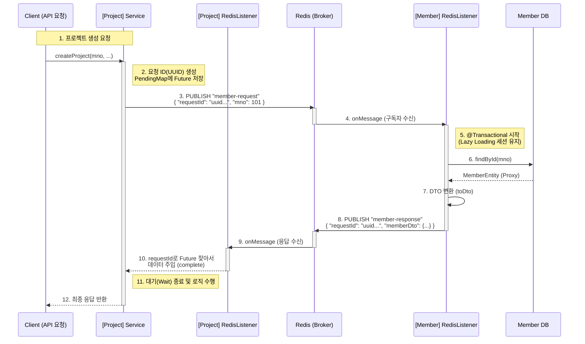

# 📡 Redis Pub/Sub 기반 MSA 동기식 통신 가이드

## 1. 📝 개요 (Overview)
이 문서는 **Project Server (8081)** 와 **Member Server (8080)** 간의 데이터 교환을 위한 **Redis Pub/Sub 통신 아키텍처**를 설명합니다.
비동기 메시징 시스템인 Redis를 사용하면서도, **CompletableFuture**를 활용하여 마치 **동기(Synchronous) 방식처럼** 응답을 기다리고 데이터를 받아오는 패턴을 구현했습니다.

### 🏛️ 시스템 구성
| 구분 | 서버명 | 역할 | Port |
| :--- | :--- | :--- | :--- |
| **요청자 (Requester)** | `LC-Eye_Project` | `mno`를 전송하고 회원 정보를 요청 | 8081 |
| **응답자 (Responder)** | `LC-Eye_Member` | DB 조회 후 회원 정보를 반환 | 8080 |
| **브로커 (Broker)** | `Redis` | 메시지 중계 (Pub/Sub) | 6379 |

---

## 2. 📊 전체 흐름도 (Text Diagram)

전체 통신 흐름도입니다.



-----

## 3\. 🚀 상세 구현 로직 (Detailed Implementation)

### Step 1: 요청 전송 (Project Server)

* **핵심:** 고유한 `requestId`(UUID)를 생성하여 **"누가 보낸 요청인지"** 표시합니다.
* **동기화 처리:** 응답이 올 때까지 기다릴 `CompletableFuture` 객체를 생성하고, `ConcurrentHashMap`에 저장해 둡니다.
* **대기:** `future.get(5, TimeUnit.SECONDS)`를 호출하여 최대 5초간 응답을 기다립니다.

### Step 2: 요청 처리 및 DB 조회 (Member Server)

* **수신:** Redis의 `8080server-member` 채널을 구독하고 있다가 메시지를 받습니다.
* **트랜잭션:** JPA 지연 로딩 문제를 방지하기 위해 리스너 메서드에 `@Transactional`을 적용합니다.
* **응답:** 요청받은 `requestId`를 그대로 복사하여 응답 DTO에 담아 `8080server-project` 채널로 발행합니다.

### Step 3: 응답 수신 및 매칭 (Project Server)

* **수신:** Redis의 `8080server-project` 채널에서 메시지를 받습니다.
* **매칭:** 메시지 속 `requestId`를 키(Key)로 사용하여 Map에 저장해 둔 `CompletableFuture`를 찾습니다.
* **완료:** `future.complete(data)`를 호출하여 Step 1에서 멈춰있던 스레드를 깨우고 데이터를 전달합니다.

-----

## 4\. 💾 데이터 구조 (Data Transfer Objects)

Redis를 통해 주고받는 JSON 데이터 포맷입니다.

### 📤 요청 (RedisRequestDto)

```json
{
  "requestId": "550e8400-e29b-41d4-a716-446655440000",
  "mno": 20003
}
```

### 📥 응답 (RedisResponseDto)

```json
{
  "requestId": "550e8400-e29b-41d4-a716-446655440000",
  "memberDto": {
    "mno": 20003,
    "name": "홍길동",
    "email": "user@example.com",
    "company": {
      "companyId": 101,
      "name": "LC-Eye Corp"
    }
  }
}
```