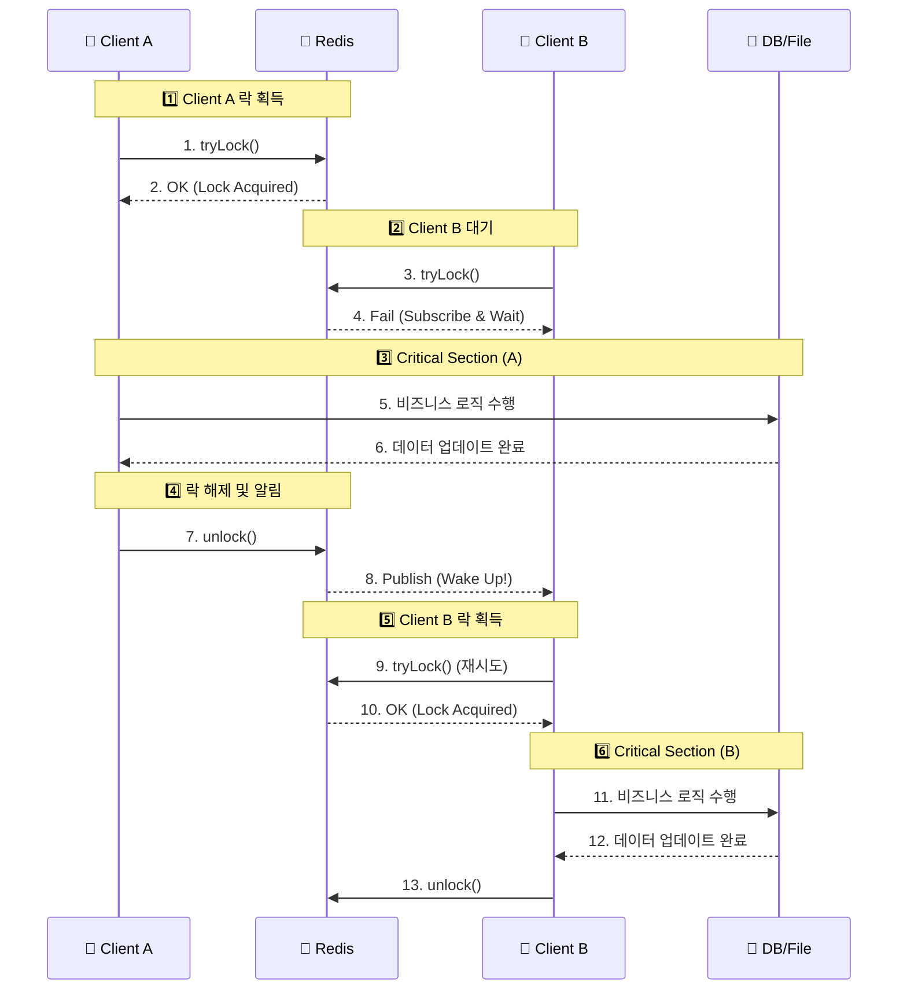

# 🔒 Redisson 분산 락(Distributed Lock) 적용 기술서

## 1. 도입 배경 (Why?)

### 1.1. 마이크로서비스 환경의 동시성 문제
우리 프로젝트는 **Member 서버(8080)**와 **Project 서버(8081)**로 분리된 구조를 가지고 있습니다. 단일 서버 환경에서는 Java의 `synchronized`나 `ReentrantLock`으로 스레드 간 동시성 제어가 가능하지만, 다중 서버(또는 다중 인스턴스) 환경에서는 각기 다른 JVM 프로세스에서 실행되므로 기존 방식으로는 **데이터 정합성(Data Consistency)**을 보장할 수 없습니다.

### 1.2. 발생 가능한 문제점
특히 **JSON 파일 시스템과 DB를 혼합하여 사용하는 로직**에서 다음과 같은 **경쟁 상태(Race Condition)**가 발생할 위험이 높았습니다.

1.  **Lost Update (갱신 손실):** 두 사용자가 동시에 파일을 수정할 때, 나중에 저장한 사람의 내용이 이전 사람의 내용을 덮어써버리는 현상.
2.  **Double Submit (중복 요청):** 자원 소모가 큰 계산 로직이 동시에 두 번 실행되어 서버 리소스를 낭비하고, 결과 데이터가 중복 생성되는 현상.

이를 해결하기 위해 **Redis**를 공용 저장소로 활용하고, 스핀 락(Spin Lock) 방식보다 부하가 적은 Pub/Sub 방식의 **Redisson** 라이브러리를 도입했습니다.

---

## 2. 작동 원리 및 흐름 (How?)

Redisson은 락을 획득하기 위해 무한정 Redis에 요청을 보내는(Spin Lock) 대신, **Pub/Sub** 방식을 사용하여 락이 해제되었을 때 대기 중인 클라이언트에게 알림을 보내는 방식으로 서버 부하를 최소화합니다.

### 2.1. 프로세스 시퀀스



### 2.2. 안전 장치 (Lease Time)

* **Wait Time:** 락을 얻기 위해 기다리는 최대 시간 (예: 10초). 이 시간이 지나면 예외를 발생시켜 무한 대기를 방지합니다.
* **Lease Time:** 락을 획득한 후, 서버 장애 등으로 락을 해제하지 못할 경우를 대비해 자동으로 락이 풀리는 시간 (예: 5초). \*\*데드락(Deadlock)\*\*을 방지하는 핵심 설정입니다.

-----

## 3\. 핵심 적용 로직 (Where?)

데이터의 무결성이 필수적인 \*\*Project 서버(8081)\*\*의 주요 서비스 로직에 적용되었습니다.

### 3.1. 투입물/산출물 정보 저장 (`ExchangeService`)

* **적용 구간:** `saveInfo` 메서드
* **문제 상황:** 다수의 작업자가 동일한 프로젝트의 JSON 파일(`exchange_...json`)을 동시에 읽고 수정할 경우, 파일 내용이 덮어씌워지는 문제.
* **Lock Key 전략:** `lock:project:exchange:{pjno}` (프로젝트 ID 단위로 잠금)
* **효과:** 한 번에 하나의 요청만 파일을 읽고 쓸 수 있도록 강제하여 **파일 데이터의 유실을 원천 차단**했습니다.

### 3.2. LCI 환경영향평가 계산 (`LCICalculateService`)

* **적용 구간:** `calcLCI` 메서드
* **문제 상황:** 계산 버튼을 연속 클릭하거나 동시 요청 시, 무거운 연산이 중복 수행되고 결과 파일 및 DB 레코드가 중복 생성됨.
* **Lock Key 전략:** `lock:project:calculate:{pjno}`
* **효과:** 이미 계산 중인 프로젝트에 대해서는 추가 요청을 거부하거나 대기시킴으로써 **서버 리소스(CPU/Memory)를 절약하고 데이터 중복을 방지**했습니다.

-----

## 4\. 코드 구현 예시

```java
// Redisson 분산 락 적용 패턴
public void executeBusinessLogic(Long keyId) {
    String lockKey = "lock:resource:" + keyId;
    RLock lock = redissonClient.getLock(lockKey);

    try {
        // 1. 락 획득 시도 (최대 10초 대기, 5초 후 자동 해제)
        boolean available = lock.tryLock(10, 5, TimeUnit.SECONDS);

        if (!available) {
            throw new RuntimeException("현재 다른 사용자가 작업 중입니다.");
        }

        // 2. 트랜잭션 범위 (락 내부에서 실행)
        service.processData(keyId);

    } catch (InterruptedException e) {
        throw new RuntimeException("서버 에러 발생");
    } finally {
        // 3. 락 해제 (현재 스레드가 락을 점유 중일 때만)
        if (lock.isLocked() && lock.isHeldByCurrentThread()) {
            lock.unlock();
        }
    }
}
```